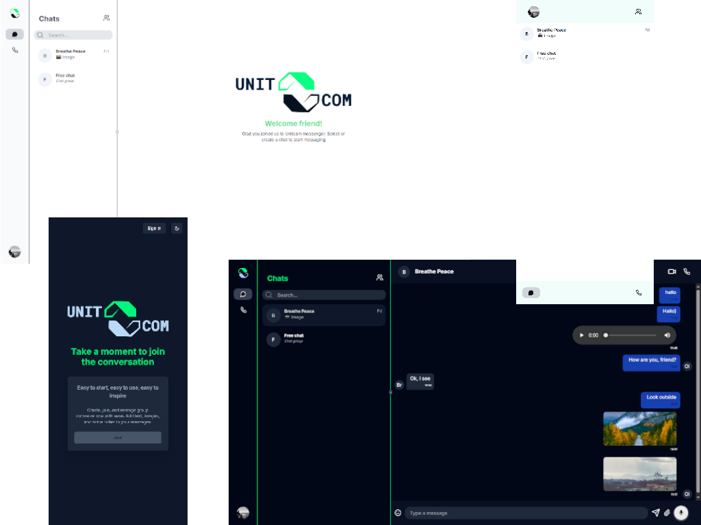

# Unitcom 🚀 (Nextjs.15 + Shadcn + Clerk + Convex + Supabase)

This project is a simplified clone of Signal, designed to demonstrate the implementation of a messaging application. The app provides a range of features, including:

- Group Chats: Create and participate in group conversations.
- File Sharing: Share files of any type, including images, audio, and PDFs.
- Voice and Video Calls: Make secure voice and video calls, with optional screen sharing.
- Contact Management: Manage contacts, including adding, editing, and deleting contacts.
- Conversation Management: Manage conversations, including creating, editing, and deleting conversations.
- Emoji Picker: Select and insert emojis into your messages.
- Dark/Light Mode: Toggle between light and dark themes.
- Real-time Notifications: Receive notifications for incoming messages and calls.

## Development with:

- [NextJS](https://nextjs.org/docs)
- [Shadcn-ui](https://ui.shadcn.com/docs)
- [TypeScript](https://www.typescriptlang.org/docs/)
- [Tailwind CSS](https://tailwindcss.com/docs)
- [Clerk](https://clerk.com/docs)
- [Convex](https://docs.convex.dev/home)
- [Supabase](https://supabase.com/docs)
- [Filepond](https://pqina.nl/filepond/)
- [Livekit](https://livekit.io/)
- [Sonner](https://sonner.npmjs.com/)
- [Zod](https://zod.dev/)
- [Pusher](https://pusher.com/)

## Getting Started

### Prerequisites

Before you begin, ensure you have the following installed:

- **Node.js** (>= 16.x)
- **Npm** (or yarn)

1. Clone the repository
2. Install the dependencies

```
npm install
```

3. Set up the environment variables

```
# Deployment used by `npx convex dev`
CONVEX_DEPLOYMENT=[YOUR_DEPLOYMENT_ID]

NEXT_PUBLIC_CONVEX_URL=[YOUR_CONVEX_URL]

NEXT_PUBLIC_CLERK_PUBLISHABLE_KEY=[YOUR_CLERK_PUBLISHABLE_KEY]
CLERK_SECRET_KEY=[YOUR_CLERK_SECRET_KEY]
CLERK_WEBHOOK_SECRET=[YOUR_CLERK_WEBHOOK_SECRET]

NEXT_PUBLIC_SUPABASE_URL=[YOUR_SUPABASE_URL]
NEXT_PUBLIC_SUPABASE_ANON_KEY=[YOUR_SUPABASE_ANON_KEY]

NEXT_PUBLIC_PUSHER_KEY=[YOUR_PUSHER_KEY]
NEXT_PUBLIC_PUSHER_CLUSTER=[YOUR_PUSHER_CLUSTER]
PUSHER_APP_ID=[YOUR_PUSHER_APP_ID]
PUSHER_KEY=[YOUR_PUSHER_KEY]
PUSHER_SECRET=[YOUR_PUSHER_SECRET]
PUSHER_CLUSTER=[YOUR_PUSHER_CLUSTER]

LIVEKIT_API_KEY=[YOUR_LIVEKIT_API_KEY]
LIVEKIT_API_SECRET=[YOUR_LIVEKIT_API_SECRET]
LIVEKIT_URL=[YOUR_LIVEKIT_URL]
```

4. Run Convex

```
npx convex dev
```

5. Run the development server

```
npm run dev
```

click here to visit => [_**Unitcom**_](https://unitcom.vercel.app/)

<div align="center">
    <p>
        <a href="https://unitcom.vercel.app" target="_blank" >
            
        </a>
    </p>
</div>

### Acknowledgements by youtube tutorial [Code With Lari](https://www.youtube.com/watch?v=kzmxtSOTYus)
